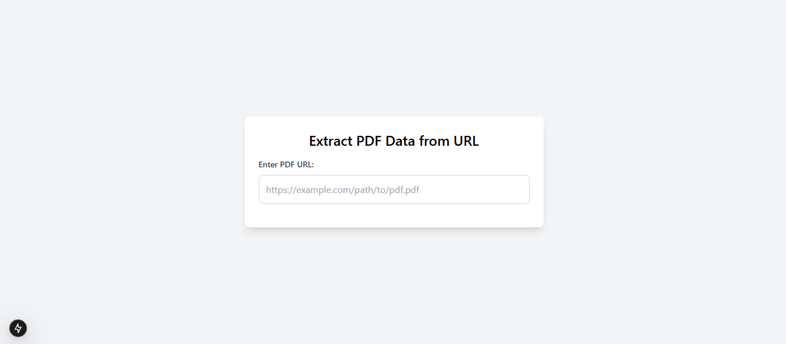
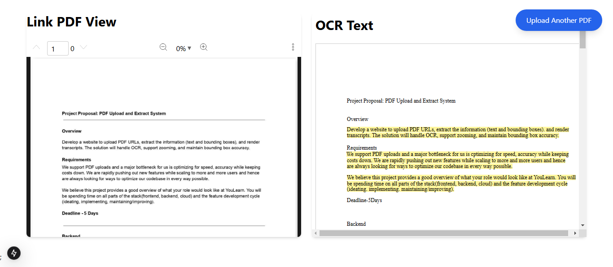
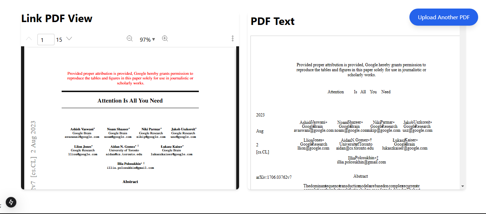

# PDF File System that Extarct data from URL

This project aim to extract the text from pdf url only. The left view show the PDF of user pasted link.
Right show extracted text.

- NextJS 15
- Tailwind
- TypeScript

## Authors

- [@nomankhokhar](https://www.github.com/nomankhokhar)

## Badges

## 🚀 About Me

I'm a full Stack Engineer....
